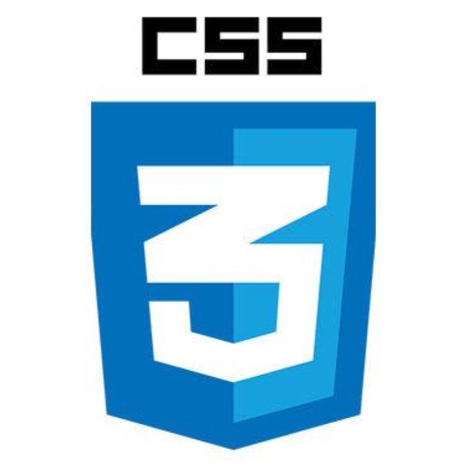

## Luke Nelson

&nbsp;&nbsp;
&nbsp;&nbsp;
&nbsp;&nbsp;

Computer Engineering Student @ [University of Michigan, Ann Arbor - College of Engineering](https://www.engin.umich.edu/) 

Software Engineering @ [SPARK](https://spark.engin.umich.edu/) 

Coder @ [CANTOR](https://michigancantor.com/) 

### Organizations

<a href="https://www.engin.umich.edu/">&nbsp;&nbsp;</a>
<a href="https://spark.engin.umich.edu/">&nbsp;&nbsp;</a>
<a href="https://michigancantor.com/">&nbsp;&nbsp;</a>

Computer Science Student with extensive experience in various programming and software fields.
Actively seeking to learn about and explore opportunities such as advanced computer vision, natural language processing, and many more. 

## Notable Projects

- [www.lukednelson.com</a>](https://www.lukednelson.com) - My website which features a Python backend for scraping college football recruiting data from four major sources, constructing an interactive database, and planning to add a task planner and a portfolio of GitHub projects.
- [Word Search](github.com/ldnelson16/wordsearch) - Word Search creator which will create a word search based on a given width and height dimension, and user inputted words. Built to showcase budding C++ data structures and algorithms skills.
- [Traffic Optimization](github.com/ldnelson16/trafficoptimizer) - A project which I am currently working on, which I will create a model that given traffic data about a city, can suggest a more optimal timing of city streetlight timings to increase the flow of traffic. I plan to complete this and hopefully showcase to local governments to improve city traffic infrastructure. 

## Skills

&nbsp;&nbsp;
&nbsp;&nbsp;
&nbsp;&nbsp;
&nbsp;&nbsp;
&nbsp;&nbsp;

&nbsp;&nbsp;
&nbsp;&nbsp;
&nbsp;&nbsp;
&nbsp;&nbsp;
&nbsp;&nbsp;

&nbsp;&nbsp;
&nbsp;&nbsp;
&nbsp;&nbsp;

## Languages

&nbsp;&nbsp;
&nbsp;&nbsp;
&nbsp;&nbsp;